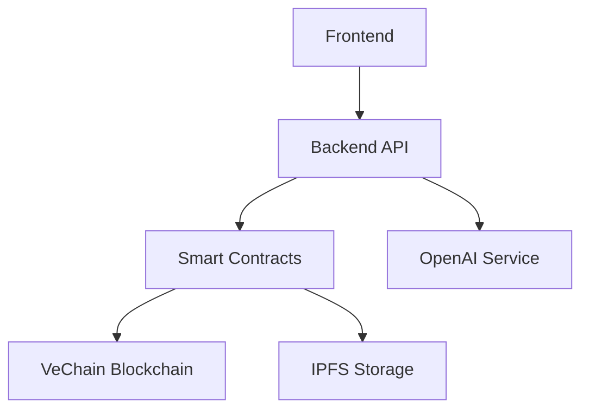

# Servare 
## Best Marketplace For addressing wasted Food

<p align="center">
  
</p>

<!-- <h1 align="center">Servare</h1> -->

<p align="center">
  <strong>A Blockchain-Based Supply Chain tracking &  Marketplace Platform for surplus food </strong>
</p>

<p align="center">
  <a href="#installation">Installation</a> •
  <a href="#features">Features</a> •
  <a href="#tech-stack">Tech Stack</a> •
  <a href="#architecture">Architecture</a> •
  <a href="#documentation">Documentation</a> •
  <a href="#contributing">Contributing</a> •
  <a href="#license">License</a>
</p>

<p align="center">
  
  =16.0.0-brightgreen.svg" alt="Node"/>
  
  
</p>

## 🌟 Overview

Servare revolutionizes supply chain management by combining blockchain technology with NFT capabilities. Our platform provides end-to-end tracking, secure trading, and AI-enhanced analytics for modern supply chain solutions.

## ✨ Features

### Supply Chain Management
- 📦 Real-time product tracking
- 🔍 Transparent chain of custody
- 📊 Supply chain analytics
- 🤖 AI-powered insights

### NFT Marketplace
- 🎨 Secure token creation
- 💱 Seamless trading platform
- 💰 Automated royalty distribution
- 🔐 Smart contract security

### Blockchain Integration
- ⛓️ VeChain compatibility
- 📝 Smart contract automation
- 🔄 Cross-chain functionality
- 🏷️ Dynamic NFT features

## 🛠 Tech Stack

### Frontend
- React.js with TypeScript
- Vite for build tooling
- Tailwind CSS for styling
- Web3 integration

### Backend
- Node.js with TypeScript
- Express.js framework
- OpenAI integration
- RESTful API design

### Blockchain
- Solidity smart contracts
- VeChain integration
- Hardhat development environment
- OpenZeppelin contracts

## 🏗 Architecture



## 📦 Installation

1. **Clone the repository**
```bash
git clone https://github.com/blankeeir/servare.git
cd servare
```

2. **Install dependencies**
```bash
yarn install
```

3. **Set up environment variables**
```bash
cp .env.example .env
# Edit .env with your configuration
```

4. **Start development servers**
```bash
# Start backend
cd apps/backend
yarn dev

# Start frontend
cd ../frontend
yarn dev
```

## 🔧 Configuration

### Backend
```env
NODE_ENV=development
PORT=3001
MONGODB_URI=mongodb://localhost:27017/servare
OPENAI_API_KEY=your_api_key
```

### Frontend
```env
VITE_API_URL=http://localhost:3001
VITE_CHAIN_ID=1
VITE_MARKETPLACE_ADDRESS=0x...
```

### Blockchain
```env
ETHERSCAN_API_KEY=your_api_key
PRIVATE_KEY=your_private_key
VECHAIN_NODE_URL=https://your.node.url
```

## 📚 Documentation

### API Endpoints

```
POST   /api/submission      # Submit new product/NFT
GET    /api/tracking/:id    # Get tracking information
POST   /api/marketplace     # List item on marketplace
```

### Smart Contract Interfaces

```solidity
interface IServareNFT {
    function mint(address to, string memory uri) external returns (uint256);
    function tokenURI(uint256 tokenId) external view returns (string memory);
}
```

## 🧪 Testing

```bash
# Run all tests
yarn test

# Run specific test suite
yarn test:contracts    # Smart contract tests
yarn test:frontend     # Frontend component tests
yarn test:backend      # Backend API tests
```

## 🚀 Deployment

### Smart Contracts
```bash
yarn deploy:contracts
yarn verify:contracts
```

### Backend
```bash
yarn build
yarn start
# Or using Docker
docker-compose up -d
```

### Frontend
```bash
yarn build
yarn preview
```

## 🤝 Contributing

1. Fork the repository
2. Create feature branch (`git checkout -b feature/amazing-feature`)
3. Commit changes (`git commit -m 'Add amazing feature'`)
4. Push to branch (`git push origin feature/amazing-feature`)
5. Open a Pull Request

## 🔒 Security

- Smart contract audited by [Audit Firm]
- Regular security assessments
- OpenZeppelin security standards
- Rate limiting and input validation

## 📄 License

This project is licensed under the MIT License - see the [LICENSE](LICENSE) file for details.

## 👥 Team

- [Lead Developer](https://github.com/username)
- [Smart Contract Developer](https://github.com/username)
- [Frontend Developer](https://github.com/username)
- [Backend Developer](https://github.com/username)

## 📞 Support

For support:
- 📧 Email: support@servare.com
- 💬 Discord: [Join our community](https://discord.gg/servare)
- 📱 Telegram: [@servare](https://t.me/servare)